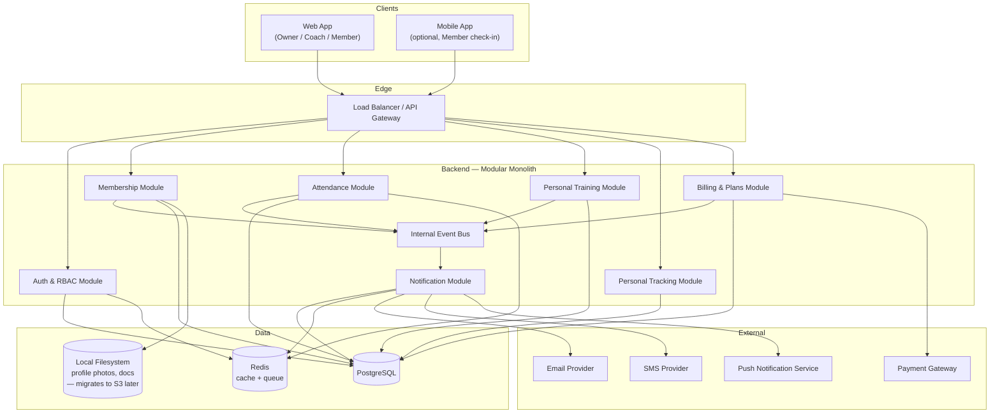
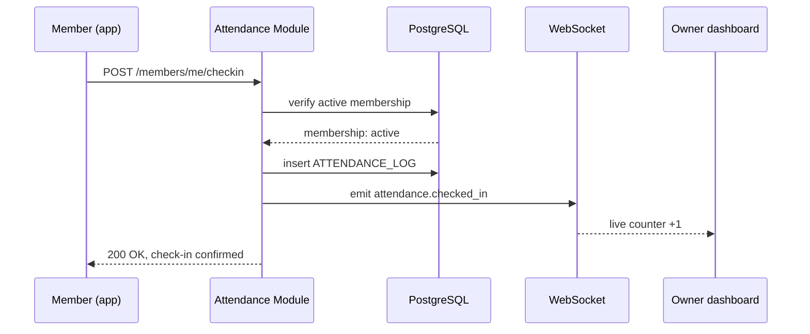
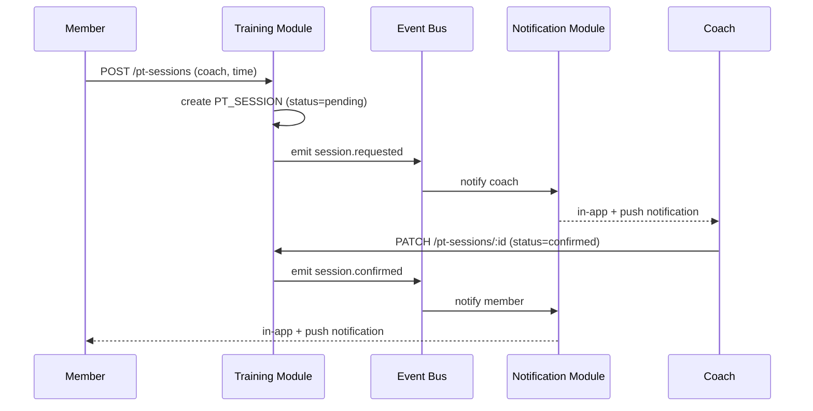
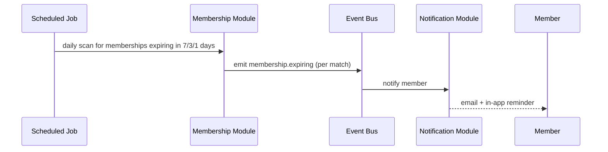
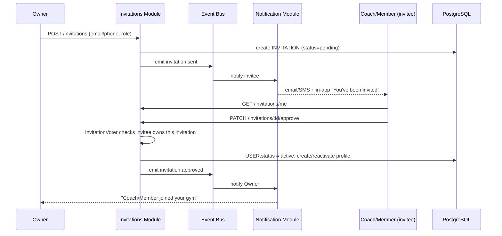
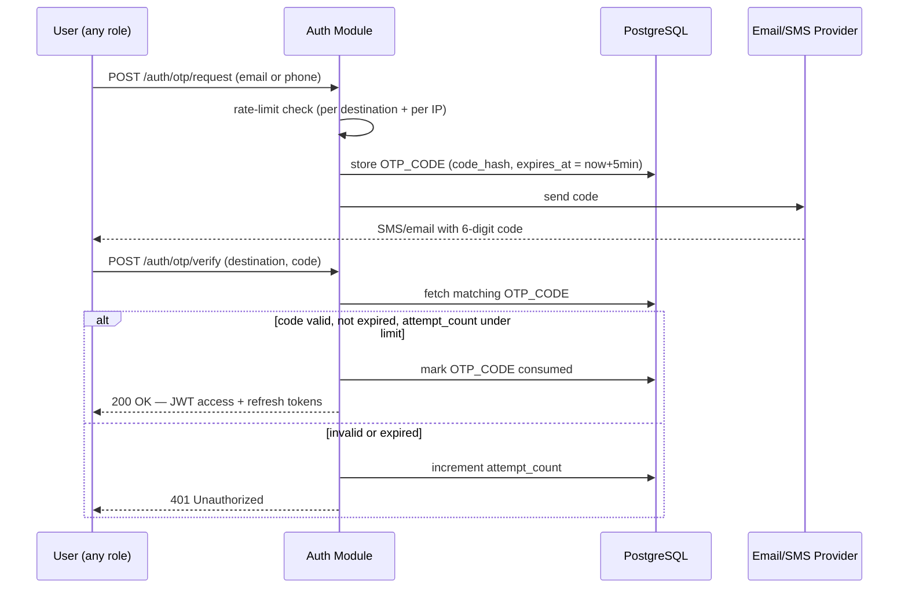

# Gym Management System — Architecture Document

**Scope:** Single-gym management platform with three user types — Owner, Coach, Member.
**Core capabilities:** membership management, attendance tracking, personal training management, personal progress tracking, role-based permissions, notifications.

---

## 1. Overview & Design Goals

| Goal | Approach |
|---|---|
| Clear separation of duties between Owner, Coach, Member | Role-based access control (RBAC) enforced at API layer |
| Fast to build, cheap to run at single-gym scale | Modular monolith, not microservices |
| Easy to extend later (multi-branch, multi-gym) | Domain modules kept decoupled internally so they can be split into services later |
| Reliable billing & attendance data | Relational database (PostgreSQL) with ACID guarantees |
| Timely alerts (bookings, expiry, announcements) | Event-driven notification module, decoupled from business logic via an internal event bus |

---

## 2. User Roles & Permissions

Three roles, enforced via RBAC middleware on every API request (JWT carries `role` + `userId`; row-level checks scope Coaches and Members to their own data).

| Capability | Owner | Coach | Member |
|---|---|---|---|
| Manage gym profile, plans, pricing | Full | — | — |
| Invite / remove / suspend staff (coaches) | Full (send invite) | — | — |
| Invite / suspend / remove members | Full (send invite) | — | — |
| **Approve / decline own invitation to join the gym** | — (cannot self-approve) | **Own invitation only** | **Own invitation only** |
| View all members & attendance | Full | Own clients only | Own record only |
| Manage class schedule | Full | Own sessions | View only |
| Accept / decline PT session requests | View all | Own requests | Request only |
| Log session notes | — | Own clients | — |
| Check in / out | Can check in others (front desk) | Self | Self |
| Personal workout & body-metric tracking | — | — | Own data |
| View revenue & reports | Full | — | — |
| Send announcements | Gym-wide | To own clients | — |
| Manage own profile & billing | — | Own | Own |
| Log in via OTP or password | Both | Both | Both |
| Receive notifications | Admin + billing alerts | Client bookings, announcements | Bookings, billing, announcements |

**Onboarding note:** an Owner never creates a fully active Coach/Member account directly — they send an **invitation**. The invitee must explicitly approve it (§6.7) before their account is active and linked to the gym. This keeps the Owner from being able to unilaterally attach someone to their gym without consent, and gives Coaches/Members an auditable accept/decline decision.

This table is the source of truth for the permission-checking middleware described in §9.1 — every new endpoint should map to a row here before being built.

---

## 3. System Architecture

### 3.1 Architectural Style

A **modular monolith**: one deployable backend service, internally split into bounded modules (Auth, Membership, Attendance, Training, Tracking, Notifications, Billing). This avoids the operational overhead of microservices at single-gym scale, while keeping module boundaries clean enough to extract a service later (e.g. if the multi-gym "hub" model comes back).

### 3.2 High-Level Diagram



### 3.3 Why this shape

- **Event bus inside the monolith** (in-process pub/sub, backed by a Redis-based queue for anything async like reminders) means the Notification module never needs to know *why* it's firing — Membership just emits `membership.expiring`, Training emits `session.requested`, and Notify subscribes. This is what let the prototype's "book a session → coach sees it → member gets confirmed" loop work, and it's the same pattern in the real backend.
- **Redis** does double duty: short-lived cache (today's attendance counts, dashboard stats) and the backing store for the background job queue (expiry checks, reminder emails).
- **File storage lives on the same server as the app for now** (§4) — profile photos and documents (waivers, medical clearance forms) are still kept out of Postgres rows, just written to local disk instead of an external bucket. The storage adapter is abstracted (§4) specifically so this can move to S3 later without touching application code.
- **The `Payment Gateway` box in §3.2's diagram represents the target design, not the current build** — billing currently runs on manual payment recording (§6.9), with no live connection to a gateway yet. The diagram shows where that connection will attach later without implying it's already wired up.

---

## 4. Tech Stack

| Layer | Recommendation | Why |
|---|---|---|
| Frontend (web) | React + TypeScript, Tailwind CSS, TanStack Query | Matches the prototype already built; TanStack Query handles server-state caching cleanly for dashboards |
| Mobile (optional, Phase 2) | React Native | Reuse component logic/patterns from web team; only needed if check-in-on-phone becomes a priority |
| Backend | PHP 8.3+ / **Symfony 7.4 LTS** (or 8.x for latest features) | Symfony bundles map directly onto the bounded modules in §3.2; Security component + Voters give first-class row-level RBAC out of the box |
| API layer | **API Platform** (built on Symfony) | Generates REST — and GraphQL if ever needed — directly from Doctrine entities, with OpenAPI docs included; cuts a lot of hand-written controller code out of §7 |
| Database | PostgreSQL | Relational integrity matters for billing, attendance, and session bookings; mature support for JSON columns where flexibility is needed (e.g. workout metrics) |
| ORM | Doctrine ORM + Doctrine Migrations | Symfony's native ORM; mature migration tooling |
| Cache / Queue | Redis + **Symfony Messenger** (Redis transport) | Reminders, expiry checks, notification dispatch as background jobs |
| Scheduled jobs | **Symfony Scheduler** component | Drives the daily membership-expiry scan in §8.3 |
| Internal event bus (§3.2, §6) | **Symfony EventDispatcher** | Native to the framework — modules emit/subscribe to domain events with no extra package |
| Auth | Symfony **Security** component + `LexikJWTAuthenticationBundle` (JWT access + refresh tokens); password login (argon2 hashing) **and** OTP login (§6.1) both issue the same JWT pair | Standard, no vendor lock-in; OTP reuses the Email/SMS providers already in the architecture (§3.2) so no new external dependency |
| Permissions (§2 table) | Symfony **Voters** | Purpose-built for "can this Coach access this PT_SESSION" style checks — maps directly onto the permission matrix |
| File storage | **Local server disk** now, via `league/flysystem-bundle`'s local adapter — same API surface as S3, so switching later is a one-line config change, not a code change | Profile photos, waivers. Move to S3-compatible storage (AWS S3 / Cloudflare R2) once traffic or backup requirements justify it — flagged as a Phase 2+ infra task, not a Phase 1 blocker |
| Payments | **Manual recording for now** — Owner marks an invoice as paid (cash/bank transfer), no gateway integration yet. `Invoice` still gets created and populated correctly, so analytics (§6.8) work unaffected. Stripe/PayHere integration is a clean drop-in later (§6.9 explains why) | Subscription billing tracked accurately without gateway complexity for the initial launch |
| Realtime | **Mercure** | Symfony's native real-time push protocol, pairs natively with API Platform; drives the live notification badge and Owner's live attendance count |
| Infra | Docker (PHP-FPM + Nginx), deployed on a single VPS or managed platform (Platform.sh / AWS ECS) | No need for Kubernetes at this scale |
| CI/CD | GitHub Actions | Test → build → deploy on merge to main |
| Monitoring | Sentry (errors) + a hosted uptime check | Minimal viable observability for a small system |

Everything below this table (data model, module boundaries, event flows, security notes) is framework-agnostic and unchanged — the module names in §3.2 now correspond to Symfony bundles, and the events referenced in §8's sequence diagrams are dispatched via EventDispatcher instead of Nest's EventEmitter.

---

## 5. Data Model

### 5.1 Entity-Relationship Diagram

```mermaid
erDiagram
    GYM ||--o{ MEMBERSHIP_PLAN : offers
    GYM ||--o{ USER : employs_or_hosts
    GYM ||--o{ ANNOUNCEMENT : publishes
    GYM ||--o{ INVITATION : sends
    GYM ||--o{ DAILY_METRIC_SNAPSHOT : tracks

    USER ||--o| COACH_PROFILE : has
    USER ||--o| MEMBER_PROFILE : has
    USER ||--o{ NOTIFICATION : receives
    USER ||--o{ OTP_CODE : requests
    USER ||--o| INVITATION : responds_to

    MEMBER_PROFILE ||--o{ MEMBERSHIP : holds
    MEMBERSHIP }o--|| MEMBERSHIP_PLAN : based_on
    MEMBERSHIP ||--o{ INVOICE : generates

    MEMBER_PROFILE ||--o{ ATTENDANCE_LOG : checks_in
    MEMBER_PROFILE ||--o{ WORKOUT_LOG : logs
    MEMBER_PROFILE ||--o{ BODY_METRIC : records

    COACH_PROFILE ||--o{ PT_SESSION : conducts
    MEMBER_PROFILE ||--o{ PT_SESSION : books

    COACH_PROFILE ||--o{ CLASS : teaches
    CLASS ||--o{ CLASS_BOOKING : has
    MEMBER_PROFILE ||--o{ CLASS_BOOKING : makes

    USER {
        uuid id PK
        string name
        string email
        string phone
        string password_hash "nullable — OTP-only users may never set one"
        enum role "owner | coach | member"
        enum status "pending_approval | active | suspended"
        timestamp created_at
    }

    INVITATION {
        uuid id PK
        uuid gym_id FK
        uuid invited_by FK "Owner's user id"
        uuid user_id FK "nullable until account exists"
        string email
        string phone
        enum role "coach | member"
        enum status "pending | approved | declined | expired"
        timestamp created_at
        timestamp responded_at
        timestamp expires_at
    }

    OTP_CODE {
        uuid id PK
        uuid user_id FK "nullable — may precede account creation"
        string destination "email or phone the code was sent to"
        string code_hash
        int attempt_count
        timestamp expires_at
        timestamp consumed_at
    }


    GYM {
        uuid id PK
        string name
        string address
        uuid owner_id FK
    }

    COACH_PROFILE {
        uuid user_id PK_FK
        string specialty
        text bio
        decimal hourly_rate
    }

    MEMBER_PROFILE {
        uuid user_id PK_FK
        date date_of_birth
        string emergency_contact
        text health_notes
        text goals
    }

    MEMBERSHIP_PLAN {
        uuid id PK
        uuid gym_id FK
        string name
        decimal price
        int duration_days
        json features
    }

    MEMBERSHIP {
        uuid id PK
        uuid member_id FK
        uuid plan_id FK
        date start_date
        date end_date
        enum status "active | paused | expired"
        bool auto_renew
    }

    INVOICE {
        uuid id PK
        uuid membership_id FK
        decimal amount
        enum status "paid | pending | failed"
        enum payment_method "cash | bank_transfer | gateway"
        uuid recorded_by FK "Owner who marked it paid — null until paid, never a Member"
        timestamp issued_at
        timestamp paid_at "null until marked paid"
    }

    ATTENDANCE_LOG {
        uuid id PK
        uuid member_id FK
        timestamp check_in
        timestamp check_out
        enum method "qr | manual | front_desk"
    }

    PT_SESSION {
        uuid id PK
        uuid coach_id FK
        uuid member_id FK
        timestamp scheduled_at
        int duration_minutes
        enum status "pending | confirmed | completed | cancelled"
        text notes
    }

    CLASS {
        uuid id PK
        uuid coach_id FK
        string name
        timestamp scheduled_at
        int capacity
    }

    CLASS_BOOKING {
        uuid id PK
        uuid class_id FK
        uuid member_id FK
        enum status "booked | attended | no_show"
    }

    WORKOUT_LOG {
        uuid id PK
        uuid member_id FK
        date date
        string type
        int duration_minutes
        json metrics
    }

    BODY_METRIC {
        uuid id PK
        uuid member_id FK
        date date
        decimal weight_kg
        decimal body_fat_pct
    }

    NOTIFICATION {
        uuid id PK
        uuid user_id FK
        string title
        text body
        enum type "booking | billing | announcement | system"
        bool read
        timestamp created_at
    }

    ANNOUNCEMENT {
        uuid id PK
        uuid gym_id FK
        text body
        timestamp created_at
    }

    DAILY_METRIC_SNAPSHOT {
        uuid id PK
        uuid gym_id FK
        date snapshot_date
        int checkins_count
        int active_members_count
        int new_members_count
        int cancelled_members_count
        decimal revenue
        int at_risk_members_count
    }
```

### 5.2 Notes on key design choices

- **`USER` is a single table with a `role` enum**, plus one-to-one profile tables (`COACH_PROFILE`, `MEMBER_PROFILE`) for role-specific fields. This keeps auth simple (one login table) while letting each role carry different data without a wide, mostly-null `users` table.
- **`MEMBERSHIP` is separate from `MEMBER_PROFILE`** so membership history is preserved even if a member changes plans or lapses and rejoins.
- **`WORKOUT_LOG.metrics` is a JSON column** deliberately — workout types vary too much (sets/reps for strength, laps for swim, HR zones for cardio) to model as rigid columns. `BODY_METRIC` stays a proper table since weight/body-fat trend queries (used for the progress chart) benefit from indexed, typed columns.
- **`NOTIFICATION` is a single flat table** for all roles — type and user_id are enough to filter; no need for role-specific notification tables.
- **`INVITATION` carries `email`/`phone` separately from `user_id`** because the invitee often doesn't have an account yet — the Owner invites by contact info, and `user_id` is filled in once the person registers/logs in and approves. `status = pending_approval` on `USER` mirrors this: the account can exist and even log in, but isn't linked to the gym (and so is invisible in gym-scoped queries) until the invitation is approved.
- **`OTP_CODE.code_hash`, never the raw code** — same reasoning as `password_hash`. `user_id` is nullable because the very first OTP request (before an account exists, e.g. self-registering Member) has nothing to attach to yet.
- **`DAILY_METRIC_SNAPSHOT` is a pre-aggregated read model, not a source of truth.** Attendance trends, revenue forecasts, and the live dashboard all need to answer "what happened over the last N days" fast — querying `ATTENDANCE_LOG`/`INVOICE` directly and re-aggregating on every dashboard load doesn't scale as history grows. A nightly job (§6.8) computes one row per gym per day; every other analytics feature reads from this table, never from raw logs. If the numbers are ever wrong, the nightly job is the one place to check — the source tables (`ATTENDANCE_LOG`, `MEMBERSHIP`, `INVOICE`) are still the ground truth it's computed from.
- **`INVOICE.payment_method`/`recorded_by`/`paid_at` support manual payment recording** (§6.9) without requiring a gateway. `recorded_by` matters specifically because marking an invoice paid is a trust-sensitive, auditable action — it should always be traceable to the Owner who did it, the same way §9's audit log covers suspensions and plan changes. When gateway integration is added later, `payment_method = 'gateway'` and `recorded_by` becomes null (the webhook did it, not a person), so the schema doesn't need to change to support both paths simultaneously.

---

## 6. Core Modules

### 6.1 Auth & RBAC
- Issues JWT access tokens (short-lived) + refresh tokens (long-lived, rotated) — same token pair regardless of which login method was used.
- **Two login methods, both supported for every role:**
  - *Password login* — `POST /auth/login` with email + password.
  - *OTP login* — `POST /auth/otp/request` (email or phone) generates a 6-digit code, hashed and stored in `OTP_CODE` with a short expiry (recommend 5 minutes), delivered via the Email/SMS provider already in §3.2. `POST /auth/otp/verify` checks it and issues the JWT pair. See §8.5 for the full flow and §9 for rate-limiting/lockout rules.
- Every request passes through a guard that checks `role` against the permission table in §2, and — for Coach/Member — scopes queries to `user.id` (a Coach can only read `PT_SESSION` rows where `coach_id = self`).

### 6.2 Membership
- Plan creation/pricing (Owner only).
- Member enrollment, plan changes, pause/cancel.
- Emits `membership.created`, `membership.expiring` (fired by a scheduled job 7/3/1 days before `end_date`), `membership.expired`.

### 6.3 Attendance
- Check-in/out, either self-service (QR code scan at gym entrance, mobile) or front-desk-assisted (Owner/staff).
- Emits `attendance.checked_in` — used for Owner's live dashboard count via WebSocket push.

### 6.4 Personal Training
- Member requests a session with a Coach → `PT_SESSION` row created as `pending`.
- Coach accepts/declines → status updates, emits `session.confirmed` / `session.declined`.
- Coach logs notes after the session.

### 6.5 Personal Tracking
- Member-only CRUD on `WORKOUT_LOG` and `BODY_METRIC`.
- No Coach/Owner access by default — this is personal health data. (If Coaches should see client progress, that's an explicit, opt-in permission grant per member, not a blanket read — flagged in §9 as a security decision to confirm with the team.)

### 6.6 Notifications
- Subscribes to events from every other module (§3.2).
- Fans out to in-app (always), and email/SMS/push based on user notification preferences.
- Delivery is async via a Symfony Messenger queue so a slow email provider never blocks the API request that triggered it.

### 6.7 Invitations & Approval
- An Owner never creates an active Coach/Member directly — they submit `POST /invitations` (email or phone + role). This creates an `INVITATION` row with `status = pending`, and either:
  - links to an existing `USER` if that email/phone is already registered, or
  - waits — the invitee registers (with password or via their first OTP login) and the invitation is matched to them by email/phone at that point.
- The invitee sees their pending invitation (`GET /invitations/me`) and explicitly **approves or declines** it — this is the "Coaches and Members approve the Owner" step. Only the invitee can act on their own invitation (`InvitationVoter`, §9.1); the Owner cannot force it through.
- On approval: `USER.status` moves from `pending_approval` to `active`, the corresponding `COACH_PROFILE`/`MEMBER_PROFILE` is created (or reactivated), and `invitation.approved` fires so the Owner gets notified.
- On decline or expiry (`expires_at` passed, recommend 7 days): the invitation is closed and no profile is created — the Owner sees the outcome but cannot retry the same invitation; they'd send a new one.
- This module owns the only two writes to `USER.status` that aren't Owner-initiated suspensions: the initial `pending_approval → active` transition, and reverting to `pending_approval` if an invitation is later revoked before approval.

### 6.8 Analytics & Reporting (Owner only)

- **Nightly aggregation job** (Symfony Scheduler, same pattern as §8.3's expiry scan): computes one `DAILY_METRIC_SNAPSHOT` row per gym per day from `ATTENDANCE_LOG`, `MEMBERSHIP`, and `INVOICE`. Everything below reads from this table, not raw logs (§5.2).
- **Live business dashboard**: today's numbers specifically (current check-ins, active members, today's revenue) are the one part of this module that *can't* wait for the nightly job — sourced live via the same Mercure/Redis pattern already used for the Phase 5 attendance counter, then reconciled into the snapshot at day's end.
- **Attendance trend analysis**: a time-series read over `DAILY_METRIC_SNAPSHOT.checkins_count`, filterable by date range — the roadmap's Phase 5 already tracks raw check-ins; this module is the first thing that turns that history into a trend rather than a live counter.
- **Revenue forecasting**: deliberately **statistical, not machine-learning**, at this scale. A weighted moving average over trailing `DAILY_METRIC_SNAPSHOT.revenue`, adjusted for known upcoming membership expirations/renewals from `MEMBERSHIP`, projected forward 30/60/90 days. This is a judgment call worth revisiting later — see the note at the end of this section.
- **Retention & churn prediction**: also rules-based initially, not ML — a Member's `at_risk` flag is computed from a small set of explainable signals (days since last check-in trending up, membership nearing expiry without a renewal action, declining visit frequency vs. their own historical average). `at_risk_members_count` on the snapshot is the aggregate; the underlying per-member flag is computed on read for the Owner's retention list, not stored per-member (it would go stale immediately and isn't needed anywhere except that one screen).
- **Exportable reports**: CSV/PDF generation of any of the above, scoped to a date range — server-rendered, downloaded on request, not pre-generated or emailed on a schedule (that's a reasonable Phase 14+ enhancement, not part of this phase).

**A judgment call worth flagging to the team explicitly:** "prediction" here means transparent, explainable heuristics — an Owner can see *why* a member is flagged at-risk, which matters more at this scale than a marginally more accurate black-box model would. If real usage later shows the heuristic is meaningfully wrong, upgrading to an actual statistical/ML model is a contained change (it only touches this module's internals — the `DAILY_METRIC_SNAPSHOT` table and the API shape don't need to change to support a better model later).

### 6.9 Billing & Payments (manual for now, gateway deferred)

- **Current scope: manual payment recording, not gateway integration.** A `Membership` enrollment creates an `INVOICE` with `status = pending`. The Owner marks it paid via `PATCH /invoices/:id/mark-paid`, supplying `payment_method` (`cash`/`bank_transfer`). This sets `status = paid`, `paid_at = now()`, and `recorded_by = <Owner's user id>`.
- **Why this doesn't block anything downstream:** §6.8's revenue forecasting and the live dashboard both read from `INVOICE`/`DAILY_METRIC_SNAPSHOT` regardless of *how* an invoice got marked paid. A manually-recorded cash payment and a future gateway webhook produce the identical row shape (`payment_method` differs, everything else is the same) — analytics doesn't need to know or care which path was used.
- **Marking an invoice paid is an auditable action**, same tier as suspending a member or changing a plan (§9's audit log rule now explicitly includes this — see below). `recorded_by` is never null once `status = paid`, except for the future gateway path where the webhook sets it directly and no human "recorded" it.
- **Gateway integration later is additive, not a rewrite:** when Stripe/PayHere is added, it becomes a second way to reach `status = paid` (via webhook instead of the Owner's manual action), using the same `INVOICE` entity, the same `InvoiceVoter` (§9.1), and the same downstream analytics. Nothing here needs to be redesigned to add it — it's a genuinely deferred feature, not a shortcut that creates rework later.
- A Member can view their own invoices (`GET /members/me/invoices`) but can never mark one paid — that's true regardless of whether the eventual payment method is manual or gateway-driven; a Member confirming their own payment would defeat the point of the Owner's record-keeping.

---

## 7. API Design (overview)

RESTful, versioned (`/api/v1/...`), documented via OpenAPI. Representative endpoints:

```
POST   /api/v1/auth/login              (email/phone + password)
POST   /api/v1/auth/otp/request        (email or phone → sends OTP)
POST   /api/v1/auth/otp/verify         (email/phone + code → JWT pair)
POST   /api/v1/auth/refresh

POST   /api/v1/invitations             (Owner — invite a coach or member)
GET    /api/v1/invitations/me          (Coach/Member — view own pending invitation)
PATCH  /api/v1/invitations/:id/approve (Coach/Member — approve own invitation only)
PATCH  /api/v1/invitations/:id/decline (Coach/Member — decline own invitation only)

GET    /api/v1/members                 (Owner)
PATCH  /api/v1/members/:id/status      (Owner — suspend/remove; not initial add, see /invitations)

GET    /api/v1/members/me/membership   (Member)
POST   /api/v1/members/me/checkin      (Member)

GET    /api/v1/coaches/:id/schedule    (Coach — own; Owner — any)
POST   /api/v1/pt-sessions             (Member — request)
PATCH  /api/v1/pt-sessions/:id/status  (Coach — accept/decline)

GET    /api/v1/members/me/workouts     (Member)
POST   /api/v1/members/me/workouts     (Member)
GET    /api/v1/members/me/body-metrics (Member)

GET    /api/v1/invoices                (Owner — all invoices for their gym)
GET    /api/v1/members/me/invoices     (Member — own invoices only)
PATCH  /api/v1/invoices/:id/mark-paid  (Owner — records payment_method, sets paid_at/recorded_by)

POST   /api/v1/announcements           (Owner)
GET    /api/v1/notifications           (any authenticated user, scoped to self)
PATCH  /api/v1/notifications/:id/read  (any authenticated user, scoped to self)

GET    /api/v1/reports/dashboard       (Owner — live business dashboard summary)
GET    /api/v1/reports/attendance      (Owner — attendance trend, date-range filterable)
GET    /api/v1/reports/revenue         (Owner)
GET    /api/v1/reports/revenue-forecast (Owner — 30/60/90-day projection)
GET    /api/v1/reports/retention       (Owner — at-risk member list with reasons)
GET    /api/v1/reports/export          (Owner — CSV/PDF, any of the above by date range)
```

Every non-Owner endpoint enforces row-level scoping in the service layer, not just the controller guard — defense in depth against a missed check.

---

## 8. Key Flows

### 8.1 Member checks in



### 8.2 Personal training booking



### 8.3 Membership expiry reminder



### 8.4 Owner invites a Coach/Member — invitee approves



Decline follows the same shape but ends at `INVITATION.status = declined`, no profile is created, and the Owner is notified of the decline instead.

### 8.5 OTP login



---

## 9. Security & Data Handling

- Passwords hashed with argon2 (or bcrypt as a simpler default).
- All traffic over HTTPS; JWTs short-lived, refresh tokens rotated and revocable.
- `MEMBER_PROFILE.health_notes` and `BODY_METRIC` are sensitive health-adjacent data — encrypt at rest (column-level or full-disk depending on hosting), and restrict access to the member themselves plus Owner-level "break glass" access with an audit log entry.
- Rate limiting on auth endpoints and check-in endpoint (prevent check-in spam / brute force).
- **OTP-specific rules:** codes are 6 digits, hashed at rest (never stored or logged in plaintext), expire in 5 minutes, and are single-use (`consumed_at` set on success). Rate-limit `/auth/otp/request` per destination *and* per IP (e.g. max 3 requests / 10 minutes) to stop SMS-bombing; lock out `/auth/otp/verify` after 5 failed attempts on a given code.
- **Invitation-specific rules:** `INVITATION.expires_at` defaults to 7 days — an unapproved invite can't be approved after expiry, closing a window where a stale invite might be accepted long after the Owner meant it. Only the invitee (matched by their authenticated `user_id`, not just by knowing the invitation ID) can approve/decline — enforced by `InvitationVoter` (§9.1), not just the frontend.
- Full audit log (`actor_id`, `action`, `entity`, `timestamp`) for any Owner action that touches another user's account (suspension, plan changes, invitations sent) **or financial record (marking an invoice paid, per §6.9)** — useful for disputes, and specifically important for manually-recorded payments since there's no gateway receipt backing them up.
- **Decision needed from the team:** should Coaches see any of their clients' `WORKOUT_LOG`/`BODY_METRIC` data? The permission table in §2 currently says no by default; if coaching quality depends on seeing progress, this should be an explicit per-client opt-in the member controls, not a role-wide grant.

### 9.1 Voter Class Outline

Each row of the §2 permission table becomes one Symfony **Voter**. Voters are registered automatically (tagged `security.voter` via autoconfiguration) and are checked with `#[IsGranted(...)]` on controllers/resources or `$this->denyAccessUnlessGranted(...)` in services — so the permission table stays the single source of truth and the code just enforces it.

A shared helper keeps role checks consistent across voters:

```php
// src/Security/Voter/AppVoter.php
abstract class AppVoter extends Voter
{
    protected function isOwner(UserInterface $user): bool
    {
        return $user instanceof User && $user->getRole() === Role::OWNER;
    }

    protected function isCoach(UserInterface $user): bool
    {
        return $user instanceof User && $user->getRole() === Role::COACH;
    }

    protected function isMember(UserInterface $user): bool
    {
        return $user instanceof User && $user->getRole() === Role::MEMBER;
    }
}
```

**GymVoter** — gym profile, plans, pricing (Owner only, §2 row 1)
```php
final class GymVoter extends AppVoter
{
    const MANAGE = 'GYM_MANAGE';

    protected function supports(string $attribute, mixed $subject): bool
    {
        return $attribute === self::MANAGE && $subject instanceof Gym;
    }

    protected function voteOnAttribute(string $attribute, mixed $subject, TokenInterface $token): bool
    {
        $user = $token->getUser();
        return $this->isOwner($user) && $subject->getOwner() === $user;
    }
}
```

**StaffVoter** — add/remove/suspend coaches (Owner only, §2 row 2)
```php
final class StaffVoter extends AppVoter
{
    const MANAGE = 'STAFF_MANAGE';

    protected function supports(string $attribute, mixed $subject): bool
    {
        return $attribute === self::MANAGE && $subject instanceof CoachProfile;
    }

    protected function voteOnAttribute(string $attribute, mixed $subject, TokenInterface $token): bool
    {
        $user = $token->getUser();
        return $this->isOwner($user) && $subject->getUser()->getGym() === $user->getGym();
    }
}
```

**MemberVoter** — add/suspend/remove members; view member records (§2 rows 3, 4)
```php
final class MemberVoter extends AppVoter
{
    const MANAGE = 'MEMBER_MANAGE';   // add / suspend / remove — Owner only
    const VIEW   = 'MEMBER_VIEW';     // Owner: any; Coach: own clients; Member: self

    protected function supports(string $attribute, mixed $subject): bool
    {
        return in_array($attribute, [self::MANAGE, self::VIEW])
            && $subject instanceof MemberProfile;
    }

    protected function voteOnAttribute(string $attribute, mixed $subject, TokenInterface $token): bool
    {
        $user = $token->getUser();

        if ($this->isOwner($user)) {
            return $subject->getUser()->getGym() === $user->getGym(); // full, gym-scoped
        }

        if ($attribute === self::VIEW && $this->isCoach($user)) {
            return $subject->hasCoach($user); // "own clients only"
        }

        if ($attribute === self::VIEW && $this->isMember($user)) {
            return $subject->getUser() === $user; // "own record only"
        }

        return false;
    }
}
```

**AttendanceVoter** — check in/out, view attendance (§2 rows 5, 6)
```php
final class AttendanceVoter extends AppVoter
{
    const CHECK_IN     = 'ATTENDANCE_CHECK_IN'; // self, or Owner on behalf of a member (front desk)
    const VIEW         = 'ATTENDANCE_VIEW';
    const VIEW_ALL     = 'ATTENDANCE_VIEW_ALL'; // Owner dashboard / reports

    protected function supports(string $attribute, mixed $subject): bool
    {
        return in_array($attribute, [self::CHECK_IN, self::VIEW, self::VIEW_ALL]);
    }

    protected function voteOnAttribute(string $attribute, mixed $subject, TokenInterface $token): bool
    {
        $user = $token->getUser();

        if ($attribute === self::VIEW_ALL) {
            return $this->isOwner($user);
        }
        if ($attribute === self::CHECK_IN) {
            return $this->isOwner($user) || ($subject instanceof MemberProfile && $subject->getUser() === $user);
        }
        // VIEW: Coach sees own clients, Member sees self, Owner covered by VIEW_ALL above
        if ($this->isCoach($user)) {
            return $subject instanceof MemberProfile && $subject->hasCoach($user);
        }
        return $subject instanceof MemberProfile && $subject->getUser() === $user;
    }
}
```

**PtSessionVoter** — request / accept / decline personal training sessions (§2 row 7)
```php
final class PtSessionVoter extends AppVoter
{
    const REQUEST  = 'PT_SESSION_REQUEST';  // Member, for self
    const RESPOND  = 'PT_SESSION_RESPOND';  // Coach, own sessions only
    const VIEW     = 'PT_SESSION_VIEW';     // Owner: any; Coach/Member: own

    protected function supports(string $attribute, mixed $subject): bool
    {
        return in_array($attribute, [self::REQUEST, self::RESPOND, self::VIEW])
            && $subject instanceof PtSession;
    }

    protected function voteOnAttribute(string $attribute, mixed $subject, TokenInterface $token): bool
    {
        $user = $token->getUser();

        return match ($attribute) {
            self::REQUEST => $this->isMember($user) && $subject->getMember()->getUser() === $user,
            self::RESPOND => $this->isCoach($user) && $subject->getCoach()->getUser() === $user,
            self::VIEW    => $this->isOwner($user)
                || ($this->isCoach($user) && $subject->getCoach()->getUser() === $user)
                || ($this->isMember($user) && $subject->getMember()->getUser() === $user),
            default => false,
        };
    }
}
```

**PersonalTrackingVoter** — workout logs & body metrics (§2 row 9 — Member-only by default)
```php
final class PersonalTrackingVoter extends AppVoter
{
    const MANAGE = 'TRACKING_MANAGE'; // WorkoutLog or BodyMetric

    protected function supports(string $attribute, mixed $subject): bool
    {
        return $attribute === self::MANAGE
            && ($subject instanceof WorkoutLog || $subject instanceof BodyMetric);
    }

    protected function voteOnAttribute(string $attribute, mixed $subject, TokenInterface $token): bool
    {
        $user = $token->getUser();
        // No Owner/Coach branch on purpose — see the open decision above.
        // If per-client opt-in ships, add: || ($this->isCoach($user) && $subject->getMember()->hasGrantedCoachAccess($user))
        return $this->isMember($user) && $subject->getMember()->getUser() === $user;
    }
}
```

**ReportVoter** — revenue, attendance, and analytics reports (§2 row 10, Owner only). Originally written for §6's basic reports; the same Voter now also gates every endpoint added by §6.8 Analytics & Reporting — no new Voter needed, since every one of those endpoints has the same shape ("Owner, own gym only").
```php
final class ReportVoter extends AppVoter
{
    const VIEW   = 'REPORT_VIEW';   // dashboard, trends, retention list, forecast
    const EXPORT = 'REPORT_EXPORT'; // CSV/PDF export specifically — kept distinct from VIEW
                                     // so exports (which leave the app as a file) can be
                                     // audit-logged separately per §9's audit log rule,
                                     // without over-logging every dashboard page view.

    protected function supports(string $attribute, mixed $subject): bool
    {
        return in_array($attribute, [self::VIEW, self::EXPORT]) && $subject instanceof Gym;
    }

    protected function voteOnAttribute(string $attribute, mixed $subject, TokenInterface $token): bool
    {
        $user = $token->getUser();
        return $this->isOwner($user) && $subject->getOwner() === $user;
    }
}
```

**InvoiceVoter** — Owner manages/marks paid, Member views own only (§6.9)
```php
final class InvoiceVoter extends AppVoter
{
    const VIEW      = 'INVOICE_VIEW';       // Owner: any in their gym; Member: own only
    const MARK_PAID = 'INVOICE_MARK_PAID';  // Owner only — a Member can never confirm their own payment

    protected function supports(string $attribute, mixed $subject): bool
    {
        return in_array($attribute, [self::VIEW, self::MARK_PAID]) && $subject instanceof Invoice;
    }

    protected function voteOnAttribute(string $attribute, mixed $subject, TokenInterface $token): bool
    {
        $user = $token->getUser();
        $gymOwnerMatches = $subject->getMembership()->getMember()->getUser()->getGym() === $user->getGym();

        if ($attribute === self::MARK_PAID) {
            return $this->isOwner($user) && $gymOwnerMatches;
        }
        // VIEW
        if ($this->isOwner($user)) {
            return $gymOwnerMatches;
        }
        return $this->isMember($user) && $subject->getMembership()->getMember()->getUser() === $user;
    }
}
```

**AnnouncementVoter** — Owner broadcasts gym-wide, Coach broadcasts to own clients only (§2 row 11)
```php
final class AnnouncementVoter extends AppVoter
{
    const CREATE = 'ANNOUNCEMENT_CREATE';

    protected function supports(string $attribute, mixed $subject): bool
    {
        return $attribute === self::CREATE && $subject instanceof Announcement;
    }

    protected function voteOnAttribute(string $attribute, mixed $subject, TokenInterface $token): bool
    {
        $user = $token->getUser();

        if ($this->isOwner($user)) {
            return $subject->getGym()->getOwner() === $user; // gym-wide
        }
        if ($this->isCoach($user)) {
            return $subject->getAudience() === Audience::OWN_CLIENTS; // scoped, not gym-wide
        }
        return false;
    }
}
```

**NotificationVoter** — every role, always scoped to self (§2 last row)
```php
final class NotificationVoter extends AppVoter
{
    const VIEW      = 'NOTIFICATION_VIEW';
    const MARK_READ = 'NOTIFICATION_MARK_READ';

    protected function supports(string $attribute, mixed $subject): bool
    {
        return in_array($attribute, [self::VIEW, self::MARK_READ]) && $subject instanceof Notification;
    }

    protected function voteOnAttribute(string $attribute, mixed $subject, TokenInterface $token): bool
    {
        return $subject->getUser() === $token->getUser(); // no role branch needed — always "own only"
    }
}
```

**InvitationVoter** — Owner sends, only the invitee can approve/decline (§2, the "approve/decline own invitation" row)
```php
final class InvitationVoter extends AppVoter
{
    const SEND    = 'INVITATION_SEND';    // Owner only, for their own gym
    const RESPOND = 'INVITATION_RESPOND'; // Coach/Member — own invitation only

    protected function supports(string $attribute, mixed $subject): bool
    {
        return in_array($attribute, [self::SEND, self::RESPOND]) && $subject instanceof Invitation;
    }

    protected function voteOnAttribute(string $attribute, mixed $subject, TokenInterface $token): bool
    {
        $user = $token->getUser();

        if ($attribute === self::SEND) {
            return $this->isOwner($user) && $subject->getGym()->getOwner() === $user;
        }

        // RESPOND: deliberately does NOT check role — a pending invitee might not
        // be "active" as Coach/Member yet, only matched by user_id/email/phone.
        return $subject->getUser() === $user
            || $subject->getEmail() === $user->getEmail()
            || $subject->getPhone() === $user->getPhone();
    }
}
```

**Usage** — controllers/resources stay declarative, and the enforcement logic lives in one place per entity rather than being scattered through service methods:

```php
#[IsGranted(PtSessionVoter::RESPOND, subject: 'ptSession')]
public function respond(PtSession $ptSession, Request $request): Response { /* ... */ }
```

Or, with API Platform, the same check can sit directly on the resource:

```php
#[ApiResource(
    operations: [
        new Patch(security: "is_granted('PT_SESSION_RESPOND', object)"),
    ]
)]
class PtSession { /* ... */ }
```

Each voter's `voteOnAttribute()` body is deliberately a direct translation of one row in the §2 table — if that table changes, the corresponding voter is the only place that needs to change too.

---

## 10. Deployment & Scalability

- Single containerized backend + single Postgres instance is sufficient for one gym (hundreds to low thousands of members). No need for read replicas or service splitting yet.
- Background workers (Symfony Messenger consumers) run as a separate container/process from the API so a burst of reminder emails never slows down live requests.
- **Local file storage (§4) means uploaded files live on the same disk as the app container.** Two practical consequences worth planning for even at this stage: (1) back up the upload directory on the same schedule as the database — a DB backup alone won't recover photos/waivers; (2) if the app ever needs to scale to more than one backend instance, local disk storage won't be shared between instances, which is the trigger to move to S3 rather than a fixed timeline.
- If the "connect multiple gyms" direction returns later, the module boundaries in §3 are what make that tractable: `Membership`, `Attendance`, etc. can be extracted into services behind the same event bus pattern, and `GYM` is already a first-class entity in the data model rather than assumed to be singular.

---

## 11. Suggested Build Order (MVP → Phase 2)

1. **MVP:** Auth/RBAC (password **and** OTP login), Invitations & approval, Membership (plans + enrollment), Attendance check-in, basic Owner dashboard.
2. **Phase 2:** Personal Training booking + Coach scheduling, Notifications (in-app + email).
3. **Phase 3:** Personal Tracking (workouts + body metrics), Billing/Invoicing — **manual payment recording first** (§6.9); gateway integration is a later, additive step, not required for this phase.
4. **Phase 4:** Analytics & Reporting (§6.8) — sequenced after Billing since revenue forecasting needs real invoice history.
5. **Phase 5 (optional):** Payment gateway integration, mobile app for check-in and push notifications, class scheduling/group bookings.

---

## 12. Getting Started — Environment, PhpStorm, and Step-by-Step Build

This section turns §4, §9.1, and §11 into an actual sequence you can execute. Each step lists what to run and which section of this doc it implements — work top to bottom and don't skip ahead to Phase 2 items before the MVP checklist is green.

### 12.1 Prerequisites

```bash
php -v          # need 8.3+
composer -V
docker -v       # Postgres, Redis, Mercure run in containers
```

Install the Symfony CLI:
```bash
curl -sS https://get.symfony.com/cli/installer | bash
```

### 12.2 Scaffold the project

```bash
composer create-project api-platform/api-platform gym-management-system
cd gym-management-system
docker compose build --pull --no-cache
docker compose up -d
```
Verify: `https://localhost/api/docs` should load the (empty) Swagger UI. This container set already includes PHP, Postgres, and Mercure — i.e. the four rows of the §4 table you'd otherwise install by hand.

Open this folder as the project root in PhpStorm.

### 12.3 PhpStorm configuration checklist

- [ ] Settings → Plugins → install **Symfony Support** (pulls in Doctrine support)
- [ ] Settings → PHP → Frameworks → check **Symfony**
- [ ] Settings → PHP → CLI Interpreter → add **Docker Compose**, service `php`
- [ ] Settings → PHP → Servers → map `/app` (container) to project root (disk), for Xdebug
- [ ] Settings → PHP → Debug → confirm port `9003`; toggle "start listening for PHP debug connections"
- [ ] View → Tool Windows → **Database** → add PostgreSQL source using credentials from `.env`
- [ ] Run `composer require --dev friendsofphp/php-cs-fixer phpstan/phpstan` then wire both under Settings → PHP → Quality Tools

Once this is done, PhpStorm can autocomplete service IDs, jump to route definitions, and step-debug inside the container — you shouldn't need to leave the IDE for the rest of the build.

### 12.4 MVP checklist (§11 phase 1)

**Step 1 — Core entities (§5.1 ER diagram)**
```bash
bin/console make:entity User          # role enum, email, phone, password_hash (nullable), status
bin/console make:entity Gym           # name, address, owner (OneToOne → User)
bin/console make:entity CoachProfile  # OneToOne → User
bin/console make:entity MemberProfile # OneToOne → User
bin/console make:migration
bin/console doctrine:migrations:migrate
```
Check off when: `Database` tool window in PhpStorm shows all four tables with correct columns.

**Step 2 — Password auth (§4 Auth row, §9 Security)**
```bash
bin/console lexik:jwt:generate-keypair
```
Edit `config/packages/security.yaml`: add the `json_login` firewall and JWT authenticator per the LexikJWTAuthenticationBundle docs.
Check off when: `POST /auth/login` returns a JWT for a seeded user, and hitting a protected route without it returns `401`.

**Step 3 — OTP login (§6.1, §8.5 sequence diagram)**
```bash
bin/console make:entity OtpCode       # user_id (nullable), destination, code_hash, attempt_count, expires_at, consumed_at
bin/console make:migration && bin/console doctrine:migrations:migrate
```
Implement `POST /auth/otp/request` (generate 6-digit code, hash it, send via configured Email/SMS provider — a `NullTransport`/log-based provider is fine for local dev) and `POST /auth/otp/verify` (check hash + expiry + attempt_count, then issue the same JWT pair as Step 2).
Check off when: requesting an OTP logs/emails a code locally, and verifying it returns a valid JWT — then confirm a stale or reused code correctly returns `401`.

**Step 4 — Invitations & approval (§6.7, §8.4 sequence diagram)**
```bash
bin/console make:entity Invitation    # gym_id, invited_by, user_id (nullable), email, phone, role, status, expires_at
bin/console make:migration && bin/console doctrine:migrations:migrate
bin/console make:voter InvitationVoter   # body already written in §9.1 — copy it in
```
Wire `POST /invitations` (Owner), `GET /invitations/me`, and `PATCH /invitations/:id/approve` / `.../decline` (invitee only, enforced by `InvitationVoter::RESPOND`). On approve, flip `User.status` to `active` and create the `CoachProfile`/`MemberProfile`.
Check off when: an Owner-created invitation is invisible/unusable to anyone except the matching invitee, the invitee can approve it, and a *different* logged-in user gets `403` trying to approve someone else's invitation.

**Step 5 — First "real data" Voter + resource (§9.1)**
```bash
bin/console make:voter MemberVoter
```
Paste in the `MemberVoter` body from §9.1, then add to `MemberProfile`:
```php
#[ApiResource(
    operations: [
        new GetCollection(security: "is_granted('MEMBER_VIEW', object)"),
    ]
)]
```
Check off when: an Owner JWT can list members; a Member JWT gets `403` trying to list *other* members. (Note: members are no longer created via a direct `POST` here — that now happens through the Step 4 invitation flow.)

**Step 6 — Membership module (§6.2, §5.1 `MEMBERSHIP_PLAN` / `MEMBERSHIP`)**
```bash
bin/console make:entity MembershipPlan
bin/console make:entity Membership
bin/console make:migration && bin/console doctrine:migrations:migrate
bin/console make:voter MembershipVoter   # follow the same pattern as MemberVoter
```
Check off when: an Owner can create a plan, and an *approved* Member can be enrolled in it via the API.

**Step 7 — Attendance module (§6.3, §8.1 sequence diagram)**
```bash
bin/console make:entity AttendanceLog
bin/console make:migration && bin/console doctrine:migrations:migrate
```
Implement `AttendanceVoter` (already written in full in §9.1 — copy it in directly) and a `POST /members/me/checkin` endpoint per §7.
Check off when: a Member JWT can check in, and the row lands in `AttendanceLog` with today's timestamp.

**Step 8 — Basic Owner dashboard**
This is the first frontend slice: a React page hitting `GET /reports/attendance` (protected by `ReportVoter`) and `GET /members`. This closes out the MVP — you now have a working, permission-checked, end-to-end vertical slice covering both login methods and the invite/approve handshake.

### 12.5 Phase 2 checklist (§11 phase 2)

- [ ] `PtSession` entity + `PtSessionVoter` (already written in §9.1) — implements §8.2's booking flow
- [ ] Wire Symfony **EventDispatcher**: dispatch `SessionRequestedEvent` / `SessionConfirmedEvent` from the PT session service (§6.4, §3.2)
- [ ] `Notification` entity + `NotificationVoter` (§9.1) + an event subscriber that turns domain events into `Notification` rows (§6.6)
- [ ] Symfony **Messenger** consumer for async email delivery: `bin/console messenger:consume async`
- [ ] Mercure hub subscription in the frontend for the live notification badge (§4 Realtime row)

### 12.6 Phase 3 & 4 checklist (§11 phases 3–4)

- [ ] `WorkoutLog` / `BodyMetric` entities + `PersonalTrackingVoter` (§9.1 — Member-only, revisit the Coach-access decision from §9 before shipping)
- [ ] `Invoice` entity + Stripe/PayHere webhook handler, triggering `membership.paid` events
- [ ] Symfony **Scheduler** job for the daily expiry scan (§8.3)
- [ ] `Class` / `ClassBooking` entities if group classes are in scope
- [ ] React Native shell reusing the same API, if the mobile app is greenlit

### 12.7 A rule of thumb while building

For every new entity: **migration → Voter → `#[ApiResource]` security expression → test with two roles (one that should succeed, one that should get `403`)** before moving to the next entity. That loop is what Step 3 above validates once — repeating it is most of the actual work in Phases 1–3.
